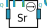
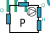
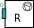
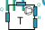

Devices
===============

The following are the devices currently implemented in the tool.

Devices are defined as python functions which apply Pyomo ``Param``, ``Var``, ``Port`` and ``Constraint`` to a ``Block``.

.. testcode::

	def PQ_Load(b, data, init_data=None):
		
		# Parameters
		b.P = pyo.Param(initialize=data['P'])
		b.Q = pyo.Param(initialize=data['Q'])
		
		# Variables
		b.S = pyo.Var(initialize=data['S'], within=pyo.Reals)
		
		# Ports
		b.port_P = Port(initialize={'P': (b.P, Port.Extensive)})
		b.port_Q = Port(initialize={'Q': (b.Q, Port.Extensive)})
		b.port_S = Port(initialize={'S': (b.S, Port.Extensive)})
		
		# Constraints
		def Constraint_S(_b):
			return _b.P**2 + _b.Q**2 == _b.S**2
		b.c_S = pyo.Constraint(rule=Constraint_S)


They are meant to be called after defining a ``Block`` object as follows:

.. testcode::

	a_load = pyo.Block()
	data = {'P':10e6, 'Q':2e6}
	PQ_Load(a_load, data)
	

One may find a need to add **time dependent** variables and relations. In such case a ``Set`` is defined:

.. testcode::

	time_list = [1, 2, 3, 4, 5] # 5 time steps
	t = pyo.Set(initialize=time_list)

and a ``t`` argument is added to the function as well as to the call

.. testcode::

	def PQ_Load(b, t, data, init_data=None):
		
		# Parameters
		b.P = pyo.Param(t, initialize=data['P'])
		b.Q = pyo.Param(t, initialize=data['Q'])
		
		# Variables
		b.S = pyo.Var(t, initialize=data['S'], within=pyo.Reals)
		
		# Ports
		b.port_P = Port(initialize={'P': (b.P, Port.Extensive)})
		b.port_Q = Port(initialize={'Q': (b.Q, Port.Extensive)})
		b.port_S = Port(initialize={'S': (b.S, Port.Extensive)})
		
		# Constraints
		def Constraint_S(_b, _t):
			return _b.P[_t]**2 + _b.Q[_t]**2 == _b.S[_t]**2
		b.c_S = pyo.Constraint(t, rule=Constraint_S)


	a_load = pyo.Block()
	data = {'P':[10e6,10e6,0,0,5e6] , 'Q':[2e6,1e6,0,0,0.5e6]}
	PQ_Load(a_load, t, data)


.. note::
   It is required to import the pyomo libraries and the devices files (if they are to be in a different file):
   
	.. testcode::
   
		# Import pyomo
		import pyomo.environ as pyo
		from pyomo.network import *

		# Import devices
		from Devices.Loads import PQ_Load
   
Hydro devices
-------------

This lists the devices related to hydro

Source
```````````````````



.. note::
   ⚠️ Ojo
   🚧 WIP

.. seealso::
	:doc:`Builder`


.. automodule:: Devices.Sources
   :members:
   :undoc-members:
   :show-inheritance:


Hydro Switch
```````````````````


   
.. automodule:: Devices.HydroSwitch
   :members:
   :undoc-members:
   :show-inheritance:
   
   
New Pump
```````````````````

.. automodule:: Devices.NewPumps
   :members:
   :undoc-members:
   :show-inheritance:


Pipes
```````````````````


   
.. automodule:: Devices.Pipes
   :members:
   :undoc-members:
   :show-inheritance:


Pumps
```````````````````


   
.. automodule:: Devices.Pumps
   :members:
   :undoc-members:
   :show-inheritance:
   

Reservoirs
```````````````````


   
.. automodule:: Devices.Reservoirs
   :members:
   :undoc-members:
   :show-inheritance:
   

Turbines
```````````````````


   
.. automodule:: Devices.Turbines
   :members:
   :undoc-members:
   :show-inheritance:
   

Electrical devices
------------------


EB (Pumping Station)
```````````````````


   
.. automodule:: Devices.EB
   :members:
   :undoc-members:
   :show-inheritance:


Main Grid
```````````````````


   
.. automodule:: Devices.MainGrid
   :members:
   :undoc-members:
   :show-inheritance:


Solar PV
```````````````````


   
.. automodule:: Devices.SolarPV
   :members:
   :undoc-members:
   :show-inheritance:


Switch
```````````````````


   
.. automodule:: Devices.Switch
   :members:
   :undoc-members:
   :show-inheritance:
